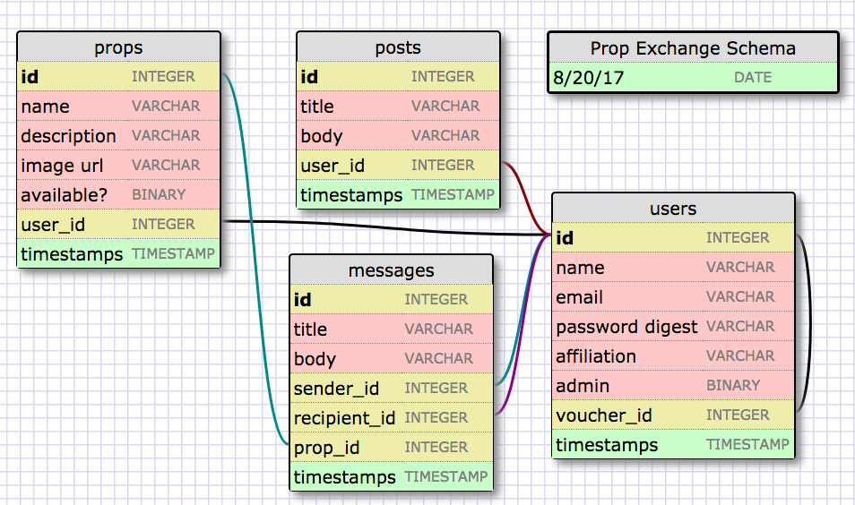

# Prop Exchange!
## A Rails Project by [Jacob Williams](https://www.linkedin.com/in/jacobgwilliams)

This is a work in progress. The purpose of this project is to create an application (starting on the web, then moving to mobile) that will allow members of the New York sketch community to post, exchange, and request props from each other more easily.

This is intended to improve upon the usefulness of the Facebook group [Sketch Props and Costumes](https://www.facebook.com/groups/1164013003650188/).

The shortcoming with this Facebook group is that it requires members to post generally in the Discussion thread of the group to request specific props, but it can be a bit of a crap shoot in terms of actually getting results.

Users should be able to:
* Create an account. _Stretch goal is users should validate identity by logging in with their Facebook account._
* Create a brief profile that states your affiliation with the community. (UCB, PIT, Magnet, Indie, etc.)
* Create a public list of props, including descriptions and photos.
* Be able to search the database of props by name and other descriptors.
* Be able to select an item, then reach out to the user who owns that item to request borrowing it.
* Toggle items in their portfolio as in use/lent out, so as not to be contacted for items not available. _(This should also probably hide items from search completely.)_
* Post publicly when they are seeking something.

* _Ruby version 2.3.0_

# Schema as of 8/20/2017:
